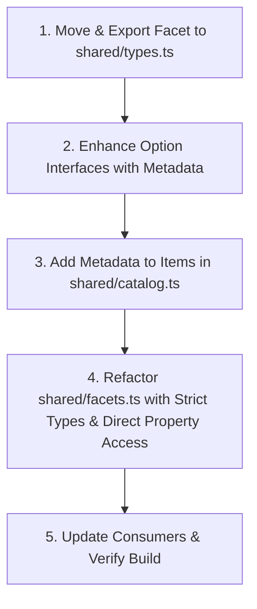

# Technical Debt Resolution Plan: `facets.ts`

## 1. Overview & Objectives

The goal of this plan is to resolve technical debt in [`shared/facets.ts`](file:///c:/Users/zubair/Documents/GitHub/gcc-website/shared/facets.ts). Specifically, it targets two core code quality issues:

1. **Anti-Pattern (Use of `any` / Weak Type Safety)**: Un-annotated exports in `shared/facets.ts` and local interface definitions in component files (`VariantSelector.tsx`) lead to weak typing and implicit `any` usage when passing facets across pages and components.
2. **Brittle Implementation (Substring Matching)**: Extracting facet values by inspecting element IDs with `.includes()`, `.startsWith()`, and regex `.replace()` on UI labels (`label.replace(' Buttons', '')`, `c.id.includes('gc-cap')`) is error-prone, tightly coupled to string formatting, and breaks easily when new items are added or renamed.

---

## 2. Root Cause Analysis

### Issue A: Implicit `any` and Decoupled Type Definitions
- In [`src/components/VariantSelector.tsx`](file:///c:/Users/zubair/Documents/GitHub/gcc-website/src/components/VariantSelector.tsx#L6-L10), the `Facet<T>` interface is defined locally:
  ```ts
  export interface Facet<T> {
    key: string;
    label: string;
    getValue: (item: T) => string | null;
  }
  ```
- In [`shared/facets.ts`](file:///c:/Users/zubair/Documents/GitHub/gcc-website/shared/facets.ts), `shellFacets`, `buttonFacets`, and `stickCapFacets` are exported as raw object literals without explicit `Facet<T>` types:
  ```ts
  export const shellFacets = [ ... ];
  ```
- When imported in [`ProductPage.tsx`](file:///c:/Users/zubair/Documents/GitHub/gcc-website/src/pages/ProductPage.tsx) or [`ShopPage.tsx`](file:///c:/Users/zubair/Documents/GitHub/gcc-website/src/pages/ShopPage.tsx), TypeScript infers generic parameter maps loosely, allowing `any` to creep in when passing arrays into `<VariantSelector ... />`.

### Issue B: Fragile Substring & String Manipulation Logic
- **Button Facets**:
  ```ts
  getValue: (b: ButtonOption) => b.label.replace(' Buttons', '').replace(' Button', '')
  ```
  *Risk*: Assumes all button labels end with `' Buttons'` or `' Button'`. If a new item is added with label `'Chrome Button Set'`, it returns `'Chrome Set'`.
- **Stick Cap Facets**:
  ```ts
  getValue: (c: StickCapOption) => {
    if (c.id.includes('extremerate')) return 'Extremerate';
    if (c.id.includes('jcd')) return 'JCD';
    if (c.id.includes('3rd-party')) return 'Other 3rd Party';
    return 'Nintendo (OEM)';
  }
  ```
  *Risk*: If an ID contains multiple keywords (e.g., `gc-cap-black-tpu-good`), order of evaluation dictates classification. Changing an ID structure breaks facet categorization silently.

---

## 3. Step-by-Step Resolution Plan



### Step 1: Centralize `Facet<T>` Type in `shared/types.ts`
- Export `Facet<T>` directly from [`shared/types.ts`](file:///c:/Users/zubair/Documents/GitHub/gcc-website/shared/types.ts):
  ```ts
  export interface Facet<T> {
    key: string;
    label: string;
    getValue: (item: T) => string | null;
  }
  ```
- Update [`src/components/VariantSelector.tsx`](file:///c:/Users/zubair/Documents/GitHub/gcc-website/src/components/VariantSelector.tsx) to import `Facet` from `@shared/types`.

### Step 2: Add Structured Metadata Fields to Types
- Update option interfaces in [`shared/types.ts`](file:///c:/Users/zubair/Documents/GitHub/gcc-website/shared/types.ts):
  ```ts
  export interface ShellOption extends CatalogItem {
    type: ShellType;
    color?: string;
    brand?: string;
  }

  export interface ButtonOption extends CatalogItem {
    type: ButtonType;
    color?: string;
    brand?: string;
  }

  export interface StickCapOption extends CatalogItem {
    brand?: 'Nintendo (OEM)' | 'Extremerate' | 'JCD' | 'Other 3rd Party';
    capType?: 'GameCube' | 'Wii';
    color?: string;
    variant?: string;
    condition?: 'Good' | 'Okay' | 'Poor';
  }
  ```

### Step 3: Update Item Catalog Data in `shared/catalog.ts`
- Enrich catalog definitions in [`shared/catalog.ts`](file:///c:/Users/zubair/Documents/GitHub/gcc-website/shared/catalog.ts) with explicit metadata attributes.
- Example for `stickCaps`:
  ```ts
  {
    id: 'wii-cap-black-good',
    label: 'OEM Wii Stick Cap - Black (good)',
    description: 'OEM black stick cap in good condition.',
    price: 6,
    individualPrice: 7,
    image: '/images/parts/wii-cap-good.png',
    brand: 'Nintendo (OEM)',
    capType: 'Wii',
    color: 'Black',
    condition: 'Good'
  }
  ```
- Example for `buttons`:
  ```ts
  {
    id: 'gray-buttons',
    label: 'Gray Buttons',
    type: 'extremerate',
    color: 'Gray',
    price: 2,
    individualPrice: 5,
    image: '/images/buttons/gray.png'
  }
  ```

### Step 4: Refactor `shared/facets.ts` with Explicit Typing and Property Access
- Rewrite [`shared/facets.ts`](file:///c:/Users/zubair/Documents/GitHub/gcc-website/shared/facets.ts) to eliminate substring matching and enforce strict return types:

```ts
import type { ShellOption, ButtonOption, StickCapOption, Facet } from './types';

export const shellFacets: Facet<ShellOption>[] = [
  {
    key: 'brand',
    label: 'Brand',
    getValue: (s) => s.brand ?? (s.type === 'oem' ? 'Nintendo (OEM)' : 'Extremerate'),
  },
  {
    key: 'color',
    label: 'Color/Style',
    getValue: (s) => s.color ?? s.label,
  },
];

export const buttonFacets: Facet<ButtonOption>[] = [
  {
    key: 'brand',
    label: 'Brand',
    getValue: (b) => b.brand ?? (b.type === 'oem' ? 'Nintendo (OEM)' : 'Extremerate'),
  },
  {
    key: 'color',
    label: 'Color',
    getValue: (b) => b.color ?? b.label.replace(/\s+Buttons?/i, ''),
  },
];

export const stickCapFacets: Facet<StickCapOption>[] = [
  {
    key: 'brand',
    label: 'Brand',
    getValue: (c) => c.brand ?? 'Nintendo (OEM)',
  },
  {
    key: 'type',
    label: 'Type',
    getValue: (c) => c.capType ?? null,
  },
  {
    key: 'color',
    label: 'Color',
    getValue: (c) => c.color ?? null,
  },
  {
    key: 'variant',
    label: 'Variant',
    getValue: (c) => c.variant ?? (c.capType === 'GameCube' ? 'Standard' : null),
  },
  {
    key: 'condition',
    label: 'Condition',
    getValue: (c) => c.condition ?? null,
  },
];
```

---

## 4. Risk Assessment & Verification Strategy

| Risk | Mitigation Strategy |
| :--- | :--- |
| Missing metadata field on newly added items | Implement fallback behavior in `getValue` logic (e.g. `s.color ?? s.label`) so app never crashes. |
| Mismatch between active facets in state and item values | Run existing integration tests and unit tests for pricing & state. |

### Verification Steps
1. **Unit Testing**: Add a test file `shared/facets.test.ts` to verify every catalog item produces valid non-empty facet values where expected.
2. **TypeScript Compilation**: Run `npx tsc --noEmit` to ensure zero `any` implicit coercions or type mismatches.
3. **UI Functional Testing**: Verify filtering in `<VariantSelector />` on both `ProductPage` and `ShopPage`.
